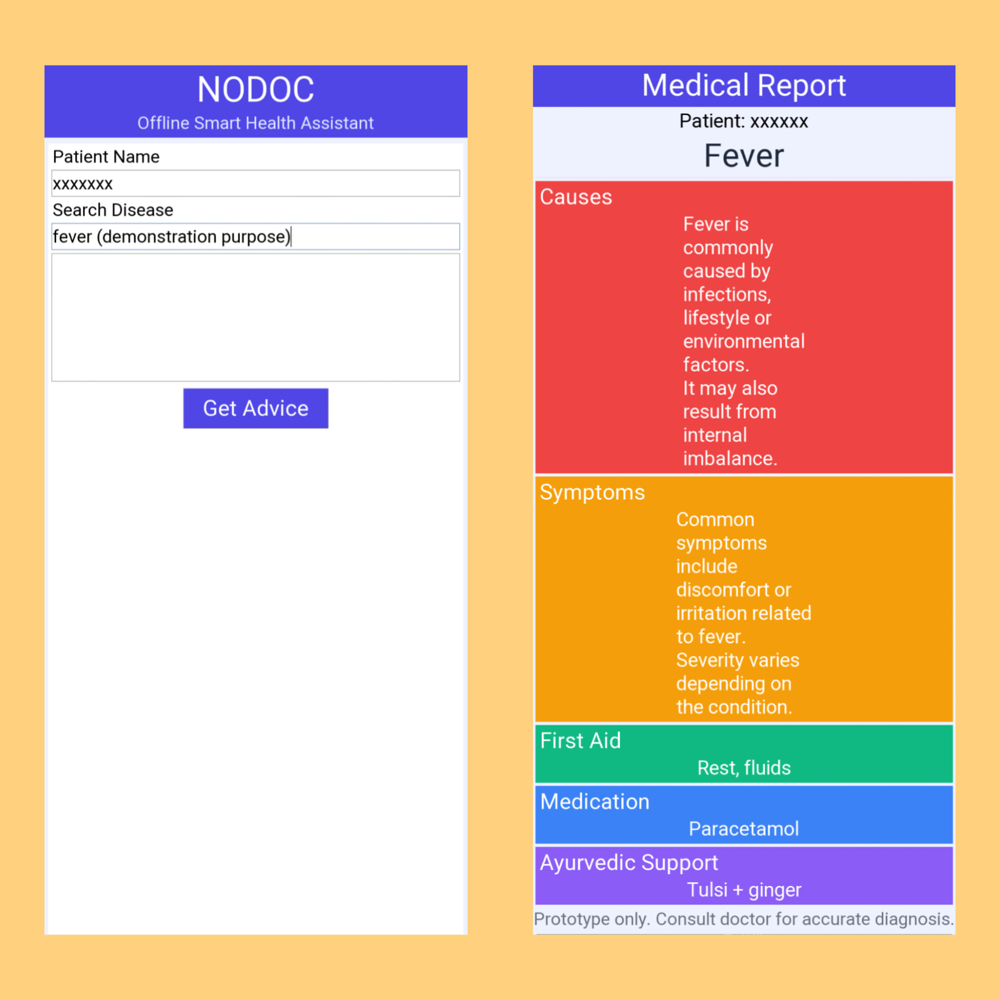

# 🩺 NODOC – Offline Health Assistant

## 📸 Preview

---

## 🌐 Overview

NODOC is a simple offline healthcare assistant built using Python and Tkinter.  
It helps users get basic first-aid advice, medicines, and Ayurvedic suggestions for common diseases.It is mainly for the rural , remote areas or hostels and sometimes in latenight cases.

---

## 🚀 Features

- 🔍 Search diseases (smart partial matching)
- 🧾 Displays:
  - Causes
  - Symptoms
  - First Aid
  - Medication
  - Ayurvedic Support
- 💻 Fully offline (no internet required)
- 🧠 Simple and user-friendly interface ( also friendly for non-technical users )

---

## 🛠️ Tech Stack

- Python
- Tkinter (GUI)

---

## ⚙️ Tools Used

- Visual Studio Code
- Git
- GitHub
- Pydroid 3

---

## 🔄 Technical Workflow

1. User enters disease name  
2. Input is processed and matched with stored data  
3. Relevant information is retrieved  
4. Results are displayed in structured UI  

---

## ▶️ How to Run

1. Install Python  
2. Clone the repository
   
   bash---
   git clone https://github.com/kuldeepsaik33/nodoc-app.git

---

## 👨‍💻 Team Members
- Kuldeep Sai (@Kuldeepsai33)
- Thanmai Sri (@thanmaisri15)

